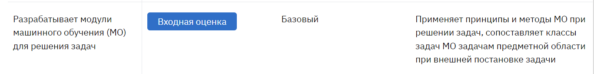

# Отчёт

__ФИО/группа:__ Ермолаева Елена Александровна БПИ224

__Вариант:__ 4

__Условие__

### Метод решения

__Тесты и результаты__

1. 

2. 

3. 
   
Рельтаты тестов программы вручную:   

1. 
### Результат работы автоматического тестирования из файла test.asm:

### Дополнительно:
<!-- 
Во все подпрограммы параметры передаются через регистры (a0, a1, fa0, fa1, fa4) согласно конвенции языка. В подпрограммах задействованы регистры временного назначения ft1 - ft11 для хранения локальных переменных. (критерий оценки 6-7). В программе нет нехватки регистров при передачи параметров или хранении локальных переменных, не нарушая конвенции, потому стек не используется.

В каждом файле отдельной подпрограммы указано, какие параметры в нее входят и за что они отвечают, а так же через какой регистр осуществляется возвращение результата, то есть указаны соответвевия фактическим параметрам (a0, fa0 и др.). (критерий оценки 6-7)

Созданные подпрограммы обернуты в соответсвующие макросы (`check_size_(%degree), pow_accurancy_macro(%x), find_root(%x), equation(%x)`)

Подгрограммы написаны в отдельных файлах, для обеспечения независимого использования в других программах (крит на оценку 8). Автоматическое тестирование в файле test.asm показывает, что функции способны функционировать независимо.

Автоматизированное тестирование выполено в файле test.asm, соответсвующий критерию 8 (воизбежание ошибок не рекомендуется хранить его в одной папке с main при запуске)

`python_solution.py` содержит решение задачи на языке Python для дополнительной проверки корректности вычислений

Программа main и tests используют соотвествующие макросы для ввода и вывода элементов массива (`print_double` и `print_str`, а так же `read_int_a0` - для считывания числа в регистр a0). Так как макросы имеют параметры, то они способены использоваться в других программах удовлетворяя критерию оценки 9

Макросы выделены в отдельную автономную библиотеку `macros.s` (критерий оценки 9)

Так же во избежание ошибок в системе рекомендуется установить слудующие настройки эмулятора и запускать только `main.s` и `test.s`, которые в свою очередь будут использовать ранее написанные подпрограммы через макросы.

__Результаты вывода `python_solution.py`__

Заметим, что совпадают с выводами программы на ассемблере 

__График__

График функции для наглядности, что на отрезке [0,1] есть корень, только один и примерно он равен 0.8, 0.9

 -->

