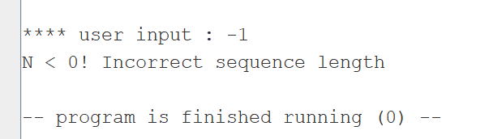

# Отчёт

__ФИО/группа:__ Ермолаева Елена Александровна БПИ224

__Вариант:__ 4

__Условие__

### Метод решения

Попрограмма файла `input.asm` отвечает за чтение файла, согласно ранее введенному названию переданному через регистр a0

Попрограмма файла `output.asm` отвечает за запись в файл, согласно ранее введенному названию переданному через регистр a0

Попрограмма файла `find_sequence.asm` отвечает за поиск последовательности длины N (введенной пользователем), которая удовлетворяет условию, что все ее члены больше предыдущего. Функция получает в качестве входных данных адрес строки и количество элементов для подпоследовательности. Последовательно считывается каждый символ, начиная с (a0 переданного как начальный адрес строки), если N элементов в строке больше предыдущих,то сохраняется начало такой последовательности, если нет, то рассматривается последовательность от позиции (a0+1) до N, и так далее.

__Тесты и результаты__

1. Файл большого размера `test_files\large_test.txt`. Запись происходит в файл `test_files\output.txt`. Ожидаемый результат: itu, при N = 3

Содержимое записавшееся в файл output.txt: 

2. Стандартный файл, содержащий нужную последовательность. N = 4. Result: jlnp. Вывод в файл output.txt

Содержимое записавшееся в файл output.txt: 

3. Некорректно заданное N < 0

4. Некорректное имя файла

5. Отказ выводить в консоль результат, при нормальных прочих данных (Ввести N при выборе Y/N)

6. Входной файл без последовательностей удовлетворяющих поиску

В консоль выводится сообщение:

7. Пустой входной файл
В консоль выводится сообщение:

Выходной файл остается/становится пустым:

### Результат работы автоматического тестирования из файла test.asm:

Тесты с использованием подпрограмм через макросы аналогичны и результаты приведены вторым скрином ниже

1. Тест подпрограммы `find_sequence` на нормальной строке `abcdefghijk`, при нормальном N  = 4

2. Тест подпрограммы `find_sequence` на нормальной строке `abcdefghijk`, при N = 0

3. Тест подпрограммы `find_sequence` на строке без последовательностей `edcba`, при N = 4

4.  Тест подпрограммы `find_sequence` на строке `abcde\niksge\abcdefA`, при N = 4

5. Тест чтения из файла при некорректном имени файла file_name = `Incorrect file name\n`

6. Тест чтения из файла при корректном имени файла file_name = `test1.txt`

7. Тест чтения из файла при корректном имени файла file_name = `empty.txt`. Файл пуст

8. Тест записи в файл строки `ABCD` при корректном имени файла file_name = `output1.txt`.

8. Тест записи в файл при некорректном имени файла file_name = `Incorrect file name\n`

### Дополнительно:

Во все подпрограммы параметры передаются через регистры (a0, a1,a3, a4, a5) согласно конвенции языка. В подпрограммах задействованы регистры временного назначения t1 - t6 для хранения локальных переменных. (критерий оценки 6-7). В программе нет нехватки регистров при передачи параметров или хранении локальных переменных, не нарушая конвенции, потому стек не используется.

В каждом файле отдельной подпрограммы указано, какие параметры в нее входят и за что они отвечают, а так же через какой регистр осуществляется возвращение результата, то есть указаны соответвевия фактическим параметрам (a0 и др.). (критерий оценки 6-7)

Созданные подпрограммы обернуты в соответсвующие макросы (`check_size_(%size), find_sequence(%x), input_file(%x), output_file(%x)`)

Подгрограммы написаны в отдельных файлах, для обеспечения независимого использования в других программах (крит на оценку 8). Автоматическое тестирование в файле test.asm показывает, что функции способны работать независимо.

Автоматизированное тестирование подпрограмм __без макросов__ выполено в файле test.asm, соответсвующий критерию 8 (воизбежание ошибок не рекомендуется хранить его в одной папке с main при запуске)

Программа `main` и `macro_tests` используют соотвествующие макросы для ввода и вывода файла, а так же обработки информации (`input_file`, `output_file`, `find_sequence` и `print_str`, а так же `read_int_a0` - для считывания числа в регистр a0). Так как макросы имеют параметры, то они способены использоваться в других программах удовлетворяя критерию оценки 9

Макросы выделены в отдельную автономную библиотеку `macro-syscalls.s` (критерий оценки 9)

